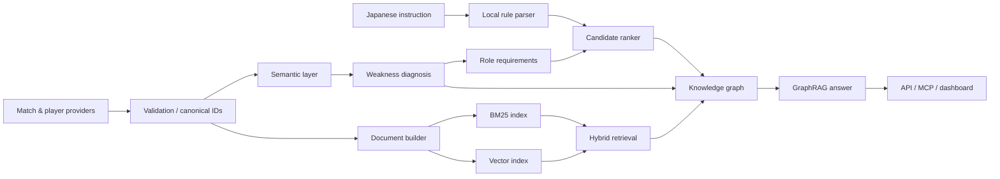

# Architecture

## Runtime flow



The local prototype is dependency-free and runs everything in memory. The interfaces are kept separate so each local component can be replaced independently.

| Concern | Local prototype | Production replacement |
|---|---|---|
| Raw storage | Versioned JSON | S3/GCS + Iceberg/Delta |
| Metric model | `semantic_metrics.json` | dbt Semantic Layer / MetricFlow |
| Keyword search | In-process BM25 | OpenSearch / Elasticsearch |
| Vectors | Stable 384-d hash embedding | Sentence Transformer or managed embedding + pgvector |
| Knowledge graph | In-memory property graph | Neo4j / Amazon Neptune |
| Workflow graph | Deterministic Python DAG | Dagster / Temporal / LangGraph |
| Traces | In-memory OTEL-shaped spans | OpenTelemetry Collector + Tempo |
| Metrics | Counters and gauges | Prometheus + Grafana |
| Serving | Python `http.server` | FastAPI on ECS/Fargate or Kubernetes |

## Why both ontology and semantic layer?

They solve different problems.

- The **semantic layer** says what a number means: grain, unit, direction, aggregation, peer mean, peer standard deviation and context filters.
- The **ontology** says how football concepts relate: a match observation indicates a weakness; a weakness needs a tactical role; a player can play a role and therefore may address that weakness.

Without the semantic layer, `18` could mean 18 entries per match or 18 percent. Without the ontology, the engine can find similar words but cannot explain why a candidate is relevant.

## GraphRAG grounding rule

The recommendation path is:

```text
Arsenal → Match → Metric observation → Weakness → Required role → Candidate
```

The UI and MCP response include those paths. A generative model can phrase the answer, but it should not introduce a recommendation unless it can cite at least one path and the underlying source quality.

## Candidate scoring

For each detected weakness:

1. Severity selects and weights the relevant target roles.
2. Each role has a versioned metric-weight profile in the ontology.
3. The candidate's best role fit is calculated from positional percentiles.
4. Tactical fit is blended with availability, age profile and budget fit.
5. Confidence is capped when source data is synthetic, sparse or stale.

Before scoring, the local instruction parser can apply explicit age, fee, availability and role constraints. Named weaknesses change their severity weights, while `即戦力` and `将来性` select different transparent score blends. The parser is deterministic, requires no paid API and returns every recognized condition for review.

This is a ranking aid, not an autonomous transfer decision. Scouting video, medical history, character, contract detail and tactical interviews remain required gates.

## Observability

Each workflow node emits a span with `trace_id`, duration, status, dependencies and output size. The root span records weakness count, retrieval hit count, candidate count and graph size. Production should additionally record:

- provider freshness and missingness;
- distribution drift by metric and position;
- retrieval precision@k on a labelled question set;
- candidate ranking stability after data refresh;
- path-grounding coverage and unsupported-claim rate;
- model/prompt/index/ontology versions.

Never put private scouting notes, credentials or licensed raw feeds into span attributes.
